# RISC-V-Processor
A RISC-V processor using Verilog on Xilinx Vivado, focusing on the architecture and functionality of the processor.

We cover a simple implementation of the MIPS (Microprocessor without Interlocked Pipeline Stages) instruction set. This implementation covers the following instructions:
### Load/Store Instructions:
- load word (lw)
- store word (sw)
### Load/Store Instructions:
- jump instruction (j)
- branch equal (beq)
### Arithmetic-logical instructions
- add
- sub
- AND
- OR
- set on less than.

# Components
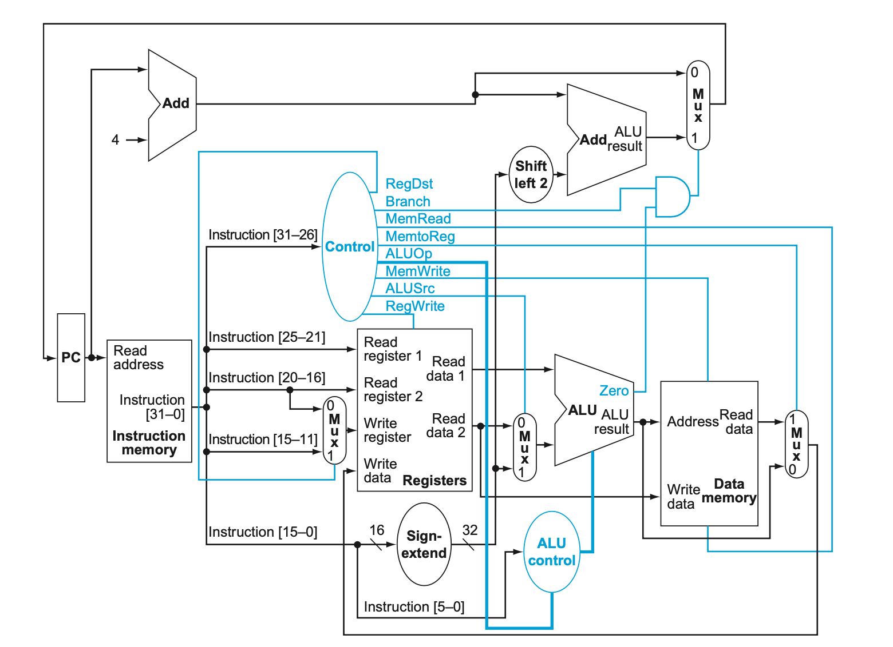

The following modules were used to implement the RISC-V processor:
### 1. Instruction Memory
- Contains of 64 32-bit instruction registers to store the instructions that the processor needs to execute.
- When the program counter (PC) provides an address, the instruction memory fetches the corresponding instruction and sends it to the control unit
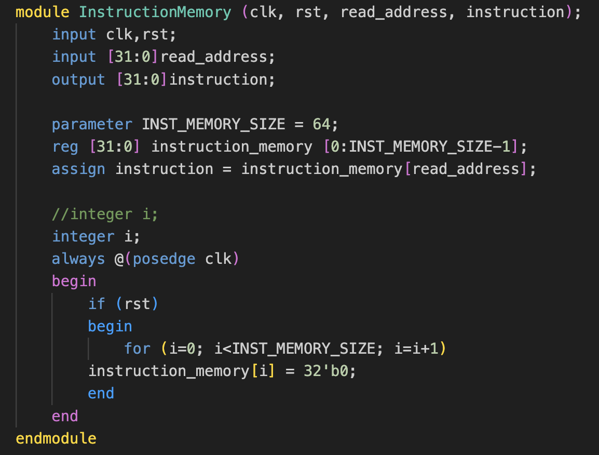

### 2. Program Counter
- Holds the address of the current instruction being executed.
- After an instruction is executed, the PC is updated to point to the next instruction

### 3. PC Adder
- Adds 4 to the current PC value to generate the address of the next sequential instruction.
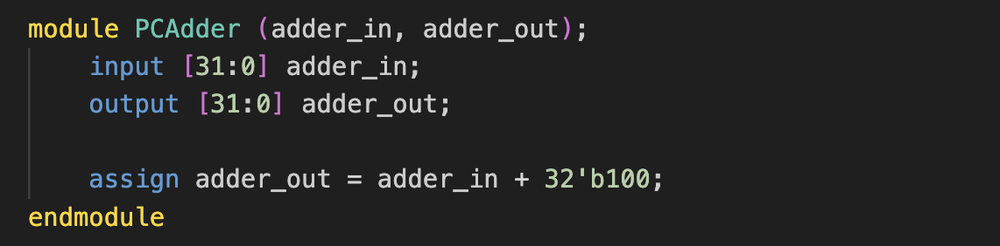

### 4. Register Module
- Contains 32 32-bit data registers to store data.
- It can read data from two registers (read_reg1 and read_reg2) and writes data to a register (write_reg) when RegWrite is enabled.
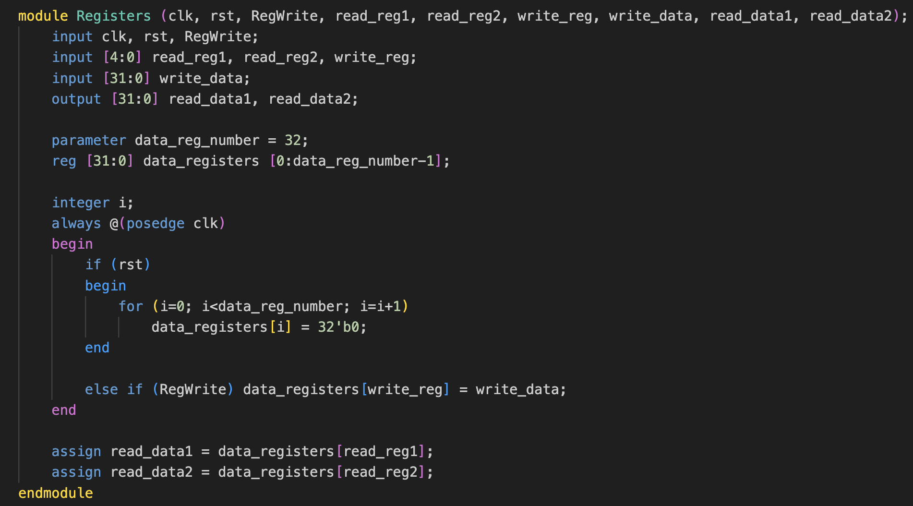

### 5. Sign Extend 16 to 32 bit
- Used to extend the 'Immediate' field of I type instructions from 16 bits to 32 bits as Program Counter length is required to be of 32 bits.
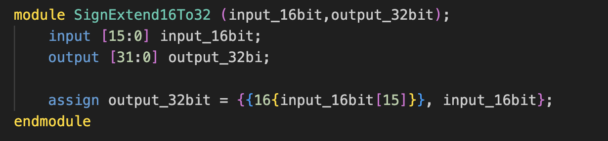

### 6. Main Control Unit
- Decodes the instruction opcode and sends appropriate control signals to other components (like the ALU, data memory, and registers) to perform the required operation.
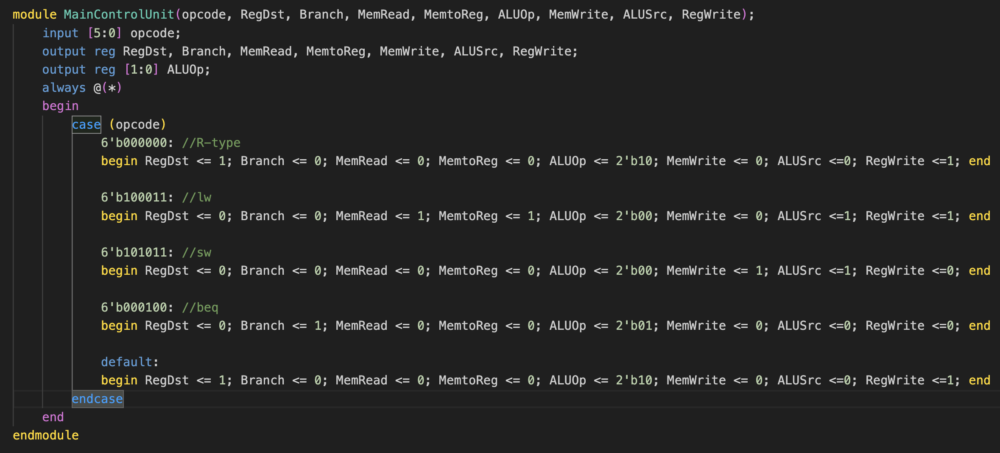
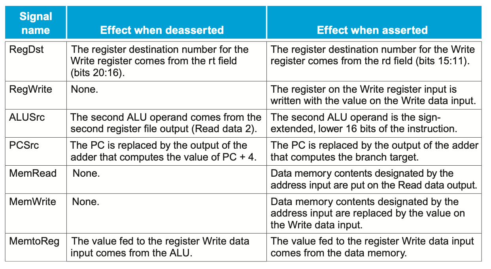
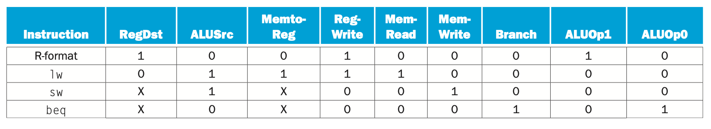

### 7. ALU Control Unit
- Provides specific control signals to the ALU based on the ALUOp signal and 'Funct' field (5:0 bits of instruction).
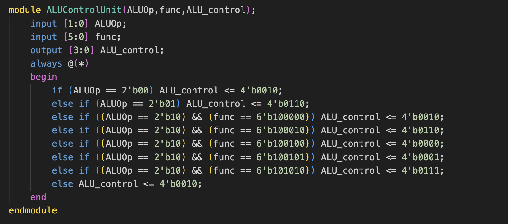
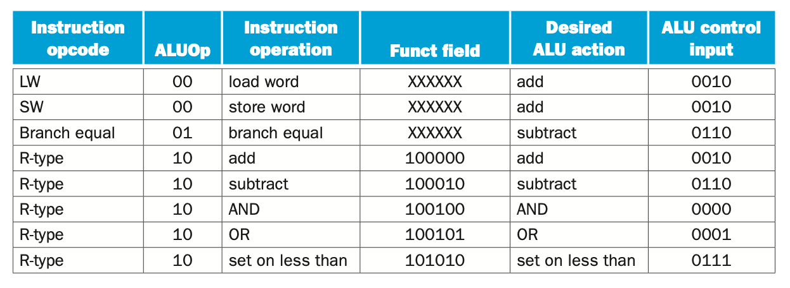

### 8. ALU (Arithmetic Logic Unit)
- Performs arithmetic and logical operations to the inputs from the registers or immediate values
- Can perform operations like addition, subtraction, AND, OR, and 'set less than'
- Outputs the ALU result and a zero signal, which can influence branching.
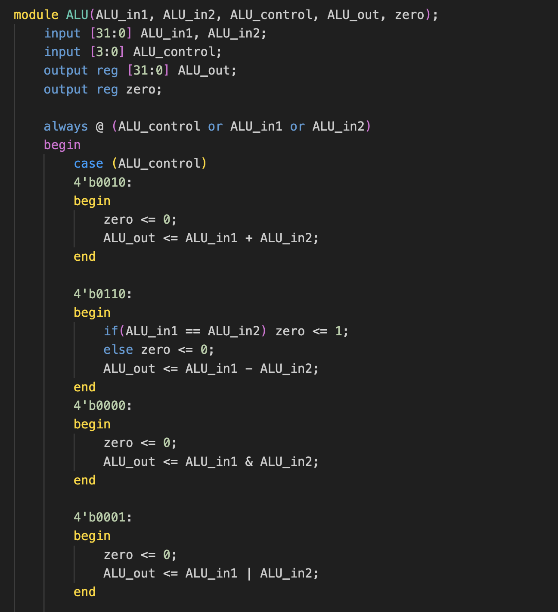
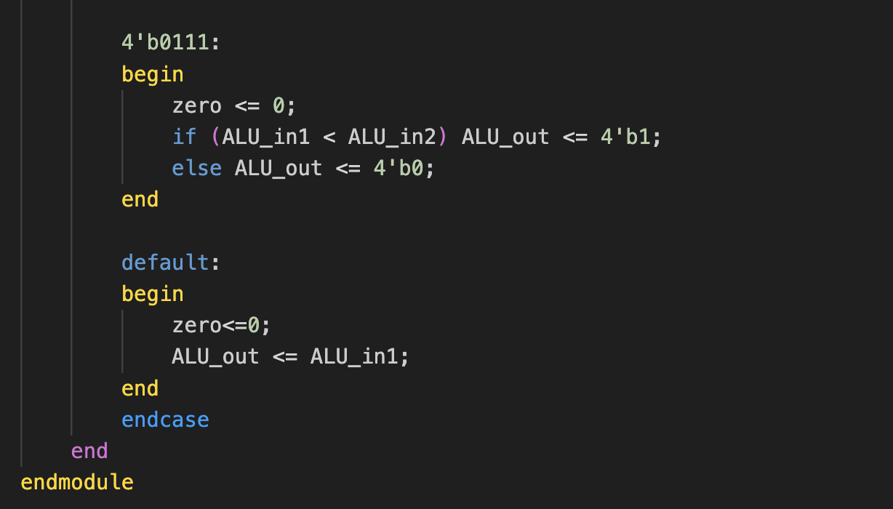

### 9. Data Memory
- Stores and retrieves data used by the program. It can theoretically hold 2^32 32-bit memory blocks. But considering hardware capacity during simulation, I have implemented 2^10 = 1024 memory blocks.
- During load (lw) and store (sw) instructions, the ALU calculates an address, and the data memory either loads data into a register or stores data from a register.
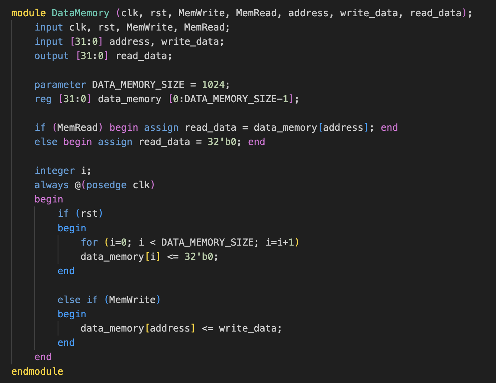

### 10. 32 bit Adder
- Used to add the offset to the PC in case of a 'beq' (branch equal) or 'jump' instruction.
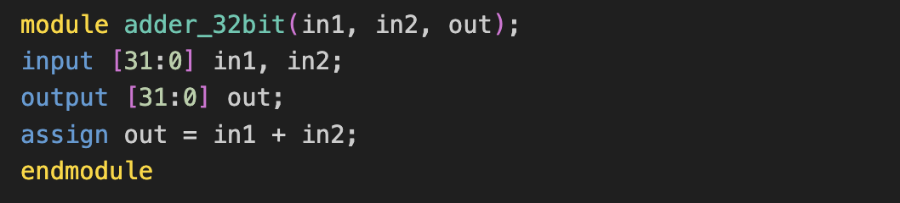

